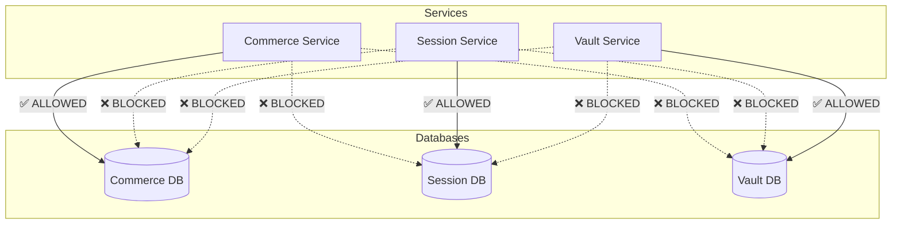

# H.I.P.S. Comprehensive Implementation Plan

This document provides a detailed, step-by-step execution guide for the three critical unbuilt phases of the H.I.P.S. Foundation Platform: **The Identity Vault API (Phase 1C)**, **Firebase Auth Integration (Phase 2)**, and the **Data Separation Test Suite (Phase 9)**. 

This plan leverages the `api-security-best-practices`, `architecture`, and `tdd-workflow` global skills.

---

## 1. Phase 1C: Build the Identity Vault API

> **Security Mandate:** The Vault Service is isolated. It must utilize Envelope Encryption (AWS KMS) and enforce an INSERT-only audit log.

### Architecture & Security Patterns
Based on the `api-security-best-practices` skill:
*   **Envelope Encryption:** Do not send plaintext PII to KMS. Request a Data Encryption Key (DEK) from AWS KMS. Encrypt the PII locally using the DEK (AES-256-GCM). Store the ciphertext and the KMS-encrypted DEK in the Vault DB.
*   **Zero Trust:** The NestJS API must be protected by an internal secret (`VAULT_API_SECRET`) and strict IP allowlisting (only accepting traffic from the Commerce and Safety subnets).
*   **Immutability:** The `VaultAccessLog` table must be strictly INSERT-only at the database role level.

### Implementation Steps (TDD Workflow)
1.  **Step 1: KMS Integration (TDD: RED)**
    *   Write a failing test in `services/vault/test` that attempts to generate a DEK and encrypt/decrypt a payload using a mock AWS KMS client.
    *   **GREEN:** Implement the AWS Encryption SDK wrapper in `vault-crypto.ts` to request DEKs and perform AES-256-GCM encryption.
    *   **REFACTOR:** Ensure memory handling zeros out plaintext DEKs after use.
2.  **Step 2: NestJS API Endpoints**
    *   Create `POST /records`: Accepts raw PII, encrypts it via KMS envelope, and writes to `IdentityRecord`.
    *   Create `GET /records/:ref`: Accepts a subject reference, decrypts the record via KMS, and returns plaintext to authorized internal callers.
    *   Create `POST /access-log`: Writes to `VaultAccessLog` with the `purpose` and `actorRef`.
3.  **Step 3: Database Role Enforcement**
    *   Apply a Prisma migration to the Vault DB.
    *   Execute raw SQL to revoke `UPDATE` and `DELETE` privileges on the `VaultAccessLog` table for the API's database user.

---

## 2. Phase 2: Integrate Firebase Auth

> **Security Mandate:** Commerce routes use Firebase. Session routes use opaque random tokens. The Session token must **never** contain the Firebase UID.

### Architecture & Security Patterns
*   **Custom Claims for RBAC:** Use Firebase Custom Claims to store the user's role (`PARTICIPANT`, `FACILITATOR`, `ADMIN`). This prevents constant DB lookups on protected routes.
*   **Next.js Middleware:** Verify the Firebase ID token in `apps/web/src/middleware.ts` before the request hits Server Components.

### Implementation Steps (TDD Workflow)
1.  **Step 1: Firebase Admin SDK Setup**
    *   Install `firebase-admin` in `apps/web`.
    *   Create an auth utility that verifies `req.headers.authorization` using `admin.auth().verifyIdToken()`.
2.  **Step 2: NestJS Roles Guard (Backend)**
    *   Create a `@Roles()` decorator and a `RolesGuard` that parses the Firebase custom claims.
    *   Apply `@Roles(UserRole.ADMIN)` to administrative routes.
3.  **Step 3: Session Token Issuance (The Hard Boundary)**
    *   Create an endpoint `POST /api/sessions/token`.
    *   **Validate:** Ensure the caller has a valid Firebase token.
    *   **Issue:** Generate a 32-byte opaque random hex token. 
    *   **Store:** Store the token in an in-memory cache (e.g., Redis or Node memory) mapped to the `sessionId`. **Do not write the Firebase UID to the cache.**
    *   Return the opaque token to the client to use for WebRTC/Three.js connections.

---

## 3. Phase 9: Data Separation Test Suite

> **Security Mandate:** You must mathematically prove that the services cannot cross-contaminate data.

### Testing Architecture
Based on `architecture` and testing best practices, we will use **Testcontainers** with Vitest to spin up three isolated PostgreSQL databases for the test suite, verifying network boundaries and schema isolation.

### Implementation Steps
1.  **Step 1: Test Infrastructure Setup**
    *   Install `testcontainers` and `vitest` in the workspace root.
    *   Create a global setup file that spins up three PostgreSQL containers on different ports (representing Commerce, Session, and Vault).
2.  **Step 2: Write Boundary Tests**
    *   Write a test: `SessionService.connect(COMMERCE_DB_URL)`. Assert that it throws a connection/authentication error.
    *   Write a test: `CommerceService.connect(VAULT_DB_URL)`. Assert that it throws.
3.  **Step 3: Write Schema Verification Tests**
    *   Connect to the Session DB.
    *   Query `information_schema.columns`.
    *   Assert that `column_name` **never** equals `email`, `firebaseUid`, `phone`, or `realName`.
4.  **Step 4: CI Enforcement**
    *   Add this test suite to `.github/workflows/data-separation.yml` so that it runs on every PR. Any failure blocks the merge.
