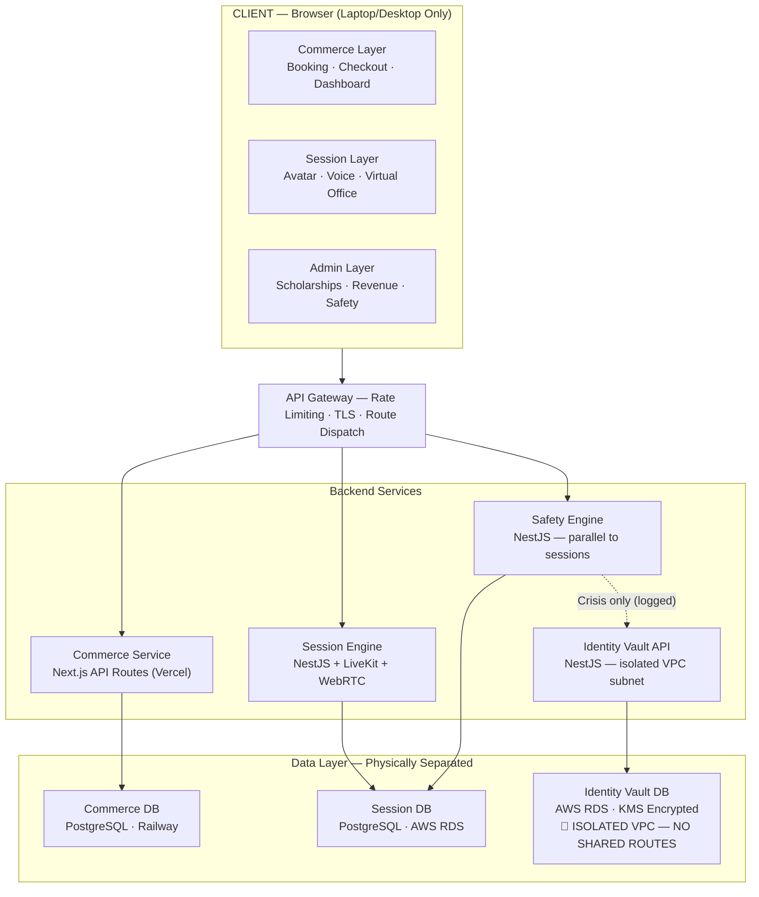

# H.I.P.S. Platform — Implementation Plan

**Foundation:** Hiding in Plain Sight Foundation  
**Version:** 1.0 | **Date:** 2026-05-05  
**Based on:** `HIPS_PRD_v1.md` · `HIPS_Ultimate_Architecture_v2.md` · `HIPS_Task_List_v1.md` · `DESIGN_SYSTEM.md` · `QUALITY_BAR.md`

---

## System Architecture




> [!IMPORTANT]
> **The hard anonymity guarantee:** `S1` (Commerce) has **zero** network routes to `D2` or `D3`. `S2` (Session) has **zero** routes to `D1` or `D3`. The vault DB subnet has no inbound from any other service. This is enforced at VPC security group level — not just policy.

---

## Lo-Fi Wireframes

````carousel
### 🏠 Homepage — Public Layer


**Key elements:**
- Nav: Logo · Services · About · Donate · Sign In
- Hero: "Find Support. Stay Anonymous." + dual CTA
- 3 service category cards (Peer Support / Coaching / Cohorts)
- Pricing tier section
- Required disclaimer footer on every service page

<!-- slide -->
### 🛒 Checkout Flow — Commerce Layer


**Key elements:**
- Progress steps: Select Service → Book Time → Checkout
- Order summary (left) + Stripe Elements (right)
- Scholarship code field (optional)
- Donation add-on widget ($50 / $100 / $500 / Custom) — **separate PaymentIntent**
- Disclaimer acknowledgement checkbox — **required, blocks submit**
- Two PaymentIntents if donation added (never bundled)

<!-- slide -->
### 🎭 Avatar Selector — Pre-Session


**Key elements:**
- 12 abstract avatar styles (no photorealistic faces)
- 3 color palette options per avatar
- Handle displayed: `Participant #7` (monospace, session-token-derived)
- Avatar **locks on session start** — security requirement
- Avatar stored in session token only — never persisted to identity

<!-- slide -->
### 🎙️ Live Session — Session Layer


**Key elements:**
- Header: anonymous handle (mono) · timer · connection quality
- Virtual Office: Three.js/WebGL room, fixed isometric camera
- Notes panel: facilitator notes (read-only participant view)
- Controls bar: Mute · Gesture ▾ · 🚩 Report · End Session
- Mobile users see a friendly block page — session token returns 403

<!-- slide -->
### 🛡️ Admin Dashboard — Staff Layer


**Key elements:**
- Sidebar: Bookings · Scholarships · Organizations · Revenue · Safety · Facilitators
- Revenue page: 4 KPI cards + bar chart (by category) + paginated table
- Safety page: escalation queue with human-review-only crisis trigger
- Scholarship queue: approve (generates code) / deny one-click actions
````

---

## Monorepo Scaffold

### Step 1 — Initialize (Phase 0)

```bash
# From d:\WORK\hsss\hips\build
pnpm init
pnpm dlx create-turbo@latest ./ --package-manager pnpm
```

**Workspace structure** (`pnpm-workspace.yaml`):
```yaml
packages:
  - "apps/*"
  - "services/*"
  - "packages/*"
```

**Directory tree to create:**
```
hips-platform/
├── apps/
│   └── web/                     # Next.js 14 App Router
├── services/
│   ├── session/                 # NestJS — WebRTC + LiveKit
│   ├── vault/                   # NestJS — Identity Vault (KMS)
│   └── safety/                  # NestJS — Safety Engine
├── packages/
│   ├── db/                      # Prisma schemas x2
│   ├── types/                   # Shared TS types + Zod schemas
│   ├── eslint-config/           # Shared ESLint config
│   └── ui/                      # Design system tokens + components
├── .github/workflows/ci.yml
├── turbo.json
├── pnpm-workspace.yaml
└── .env.example
```

### Step 2 — Next.js App (`apps/web`)

```bash
cd apps && pnpm dlx create-next-app@latest web \
  --typescript --tailwind --app --no-src-dir \
  --import-alias "@/*"
```

**Route groups to create immediately:**
```
apps/web/app/
├── (public)/
│   ├── page.tsx              # Homepage
│   ├── services/page.tsx
│   ├── services/[slug]/page.tsx
│   ├── donate/page.tsx
│   └── organizations/page.tsx
├── (auth)/
│   ├── sign-in/page.tsx
│   └── sign-up/page.tsx
├── (app)/
│   ├── dashboard/page.tsx
│   ├── book/[serviceId]/page.tsx
│   ├── checkout/page.tsx
│   ├── scholarship/page.tsx
│   └── dashboard/packages/page.tsx
├── (session)/
│   ├── session/[id]/page.tsx
│   └── lobby/[groupId]/page.tsx
└── (admin)/
    ├── bookings/page.tsx
    ├── scholarships/page.tsx
    ├── organizations/page.tsx
    ├── revenue/page.tsx
    ├── safety/page.tsx
    └── facilitators/page.tsx
```

### Step 3 — NestJS Services

```bash
# For each service: session, vault, safety
cd services
pnpm dlx @nestjs/cli new session --package-manager pnpm --skip-git
pnpm dlx @nestjs/cli new vault  --package-manager pnpm --skip-git
pnpm dlx @nestjs/cli new safety --package-manager pnpm --skip-git
```

### Step 4 — Prisma Schemas (`packages/db`)

Two separate schemas, two separate `DATABASE_URL` env vars:

```bash
cd packages/db
pnpm add prisma @prisma/client
npx prisma init --schema=./prisma/commerce.prisma
npx prisma init --schema=./prisma/session.prisma
```

---

## Sprint Plan

| Sprint | Phases | Key Deliverables | Gate |
|--------|--------|-----------------|------|
| **1** | 0, 1A | Monorepo, CI, environments, Commerce DB schema, seed | `pnpm build` green |
| **2** | 1B, 1C (infra) | Session DB, VPC, KMS, Vault DB provisioned | AWS BAA signed |
| **3** | 1C (service), 2 | Identity Vault API (NestJS), Firebase Auth, anon tokens | Security review gate |
| **4** | 3.1–3.9 | Booking, packages, scholarships API | Integration tests pass |
| **5** | 3.10–3.17, 4 | Org inquiry, Stripe webhooks, Resend emails | Stripe live test |
| **6** | 5.1–5.8 | Session tokens, WebSocket gateway, WebRTC voice | Load test: 10 sessions |
| **7** | 6 | Safety Engine, crisis protocol, escalation queue | Human reviewer assigned |
| **8** | 7.1–7.8 | Public pages: homepage, catalog, booking, checkout | Copy linter pass |
| **9** | 7.9–7.15, 8 | User dashboard + full Admin panel | WCAG AA audit |
| **10** | 9 | Avatar selector, Three.js virtual office, voice controls | WebGL fallback tested |
| **11** | 10 | Full test suite: unit, integration, E2E, load, security | 80%+ coverage all packages |
| **12** | 11 | Legal review, production config, launch gates | All 14 launch gates ✅ |

---

## Critical Path

```
Phase 0 (Repo + CI)
  → Phase 1A (Commerce DB schema)
  → Phase 1C (Identity Vault) ◀── GATE: NOTHING session-related ships before this
    → Phase 2 (Auth layer: Firebase + anon tokens)
      → Phase 3 (Commerce API)
        → Phase 5 (Session services — WebRTC + LiveKit)
          → Phase 6 (Safety Engine + Crisis Protocol)
            → Phase 7–9 (All frontend)
              → Phase 10 (Session frontend — Three.js)
                → Phase 10 (Testing)
                  → Phase 11 (Launch)
```

**Parallelizable streams** (after their gates are met):
- `1A` Commerce DB ↔ `1B` Session DB
- `3` Commerce API ↔ `5` Session services
- `7` Public frontend ↔ `8` Admin panel

---

## Key Package Decisions

| Layer | Package | Version | Why |
|-------|---------|---------|-----|
| Frontend | `next` | `14.x` | App Router, Server Components |
| Auth | `firebase-admin` | `12.x` | Commerce auth; custom anon tokens for session |
| DB ORM | `@prisma/client` | `5.x` | Type-safe, dual-schema support |
| Validation | `zod` | `3.x` | All API inputs validated before DB |
| Forms | `react-hook-form` | `7.x` | + Zod resolver |
| Payments | `stripe` | `14.x` | Nonprofit receipt compliance |
| Email | `resend` | `3.x` | Template system, Resend SDK |
| 3D/WebGL | `three` + `@react-three/fiber` | latest | Virtual office + avatars |
| Icons | `lucide-react` | latest | MIT, consistent stroke weight |
| NestJS | `@nestjs/core` | `10.x` | Session/Vault/Safety microservices |
| WebRTC | `livekit-server-sdk` | latest | Self-hosted in HIPAA VPC |
| Testing | `vitest` + `playwright` | latest | Unit/integration + E2E |
| Monorepo | `turbo` | `2.x` | Build caching, task orchestration |

---

## Design Token Quick Reference

```css
/* packages/ui/src/tokens/colors.css */
:root {
  /* Brand */
  --color-brand-primary:   #2D5A8E;  /* CTAs, active nav, focus rings */
  --color-brand-secondary: #4A8FA8;  /* Hover states, accents */
  --color-brand-accent:    #7BC4C4;  /* Highlights, progress */
  --color-brand-warm:      #E8D5B7;  /* Card fills, public pages */
  --color-brand-deep:      #1A3A5C;  /* Headings, footer */

  /* Semantic */
  --color-success: #059669;
  --color-warning: #D97706;
  --color-error:   #DC2626;
  --color-crisis:  #7F1D1D;  /* Crisis overlay ONLY */

  /* Session layer (scoped to [data-layer="session"]) */
  --session-bg:           #0D1B2A;
  --session-controls-bg:  rgba(13,27,42,0.85);
  --session-avatar-ring:  #7BC4C4;
}
```

**Fonts:** Inter (UI) · JetBrains Mono (session handles, tokens)

---

## CI Pipeline (`ci.yml`)

```yaml
name: CI
on: [push, pull_request]
jobs:
  ci:
    runs-on: ubuntu-latest
    steps:
      - uses: actions/checkout@v4
      - uses: pnpm/action-setup@v3
      - run: pnpm install --frozen-lockfile
      - run: pnpm typecheck
      - run: pnpm lint
      - run: pnpm test
      - run: pnpm build
      - run: pnpm audit --audit-level=high
      - run: pnpm copycheck
```

> [!CAUTION]
> `pnpm copycheck` must run on **every** PR. Any PR touching UI copy, email templates, or service pages that contains banned terms (`therapy`, `treatment`, `diagnosis`, `clinical`, `counseling`) **fails CI automatically** before human review.

---

## Phase 0 — Immediate Next Steps

Run these in order from `d:\WORK\hsss\hips\build`:

```powershell
# 1. Initialize monorepo
pnpm init

# 2. Create workspace config
New-Item pnpm-workspace.yaml
# content: packages: ["apps/*", "services/*", "packages/*"]

# 3. Create directory structure
mkdir apps\web, services\session, services\vault, services\safety
mkdir packages\db, packages\types, packages\ui, packages\eslint-config

# 4. Create Next.js app
cd apps
pnpm dlx create-next-app@latest web --typescript --tailwind --app --no-src-dir

# 5. Init turbo
cd ..
pnpm dlx turbo init

# 6. Add shared dev deps at root
pnpm add -Dw typescript eslint prettier vitest

# 7. Copy .env.example from docs/HIPS_PRD_v1.md env vars
```

---

## Launch Gates Checklist

> [!IMPORTANT]
> All 14 gates must be ✅ before production go-live.

- [ ] All Phase 0–9 tasks at `✅ Done`
- [ ] Identity Vault penetration test completed; all findings resolved
- [ ] Session ↔ Commerce DB separation test: `connection refused` assertion passes
- [ ] 50-concurrent-session load test: no session data leakage
- [ ] Full E2E: booking, donation, scholarship, session entry flows green
- [ ] WCAG AA audit complete; crisis overlay screen-reader verified
- [ ] Copy linter: zero banned-language violations on any surface
- [ ] Crisis reviewer assignment document signed by Program Lead + Founder
- [ ] AWS HIPAA BAA signed and activated
- [ ] CloudTrail, GuardDuty, Security Hub enabled
- [ ] All secrets in Vercel + AWS Secrets Manager — none in version control
- [ ] CloudWatch alarms: vault anomaly, auth failures, KMS decrypt spike
- [ ] Resend domain verified; all email templates tested end-to-end
- [ ] Stripe live keys configured; webhook endpoint registered; 4 events verified

---

## Open Decisions Required Before Build Starts

| # | Question | Owner | Needed By |
|---|----------|-------|-----------|
| OQ.1 | HIPAA cloud: AWS or GCP? | Founder / Infra | Sprint 2 |
| OQ.2 | Will clinicians ever be staffed? (shapes Safety Engine scope) | Founder / Legal | Sprint 1 |
| OQ.3 | Scheduling tool: Cal.com self-hosted, custom, or Calendly API? | Tech Lead | Sprint 4 |
| OQ.4 | Consent-based voice recording in v1 or deferred to v2? | Founder / Legal | Sprint 6 |
| OQ.5 | Crisis protocol: who are the designated human reviewers? | Program Lead | Sprint 7 |

---

*Maintained by: Tech Lead · Review before every phase milestone*
